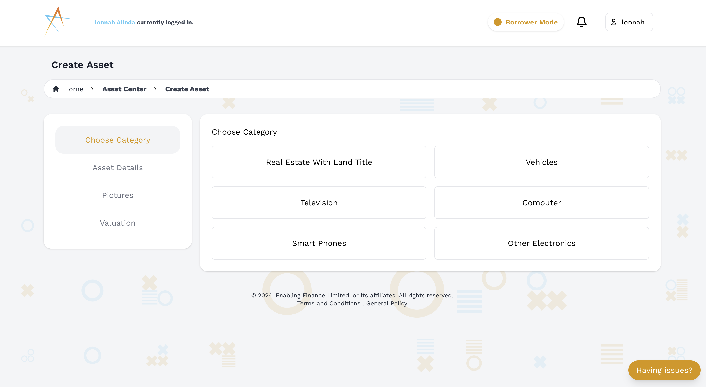
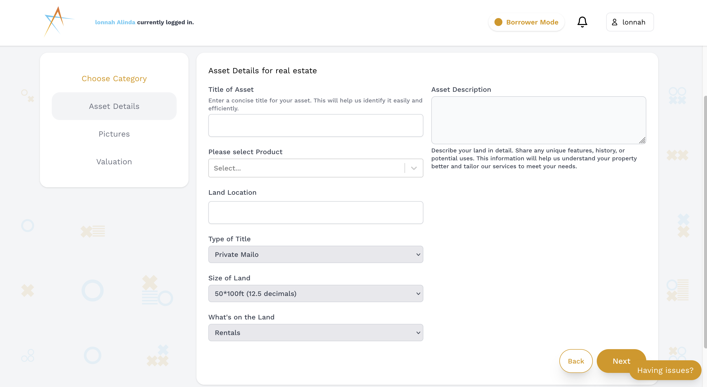
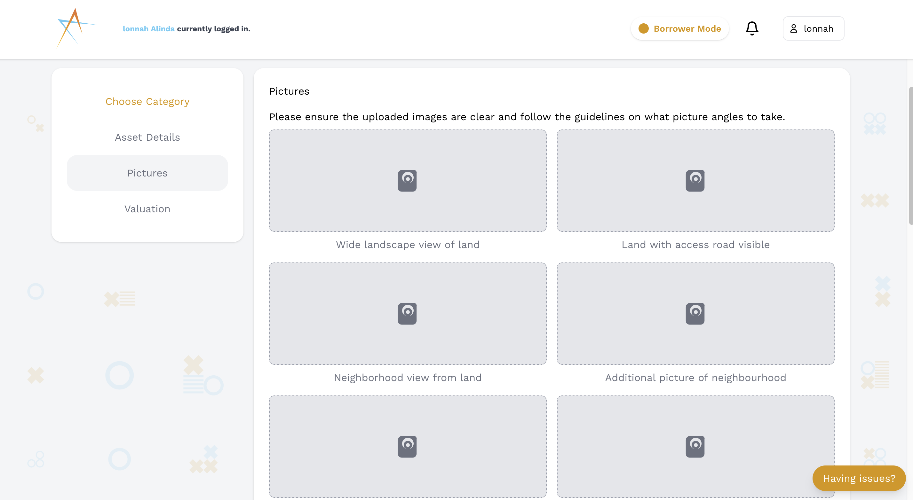
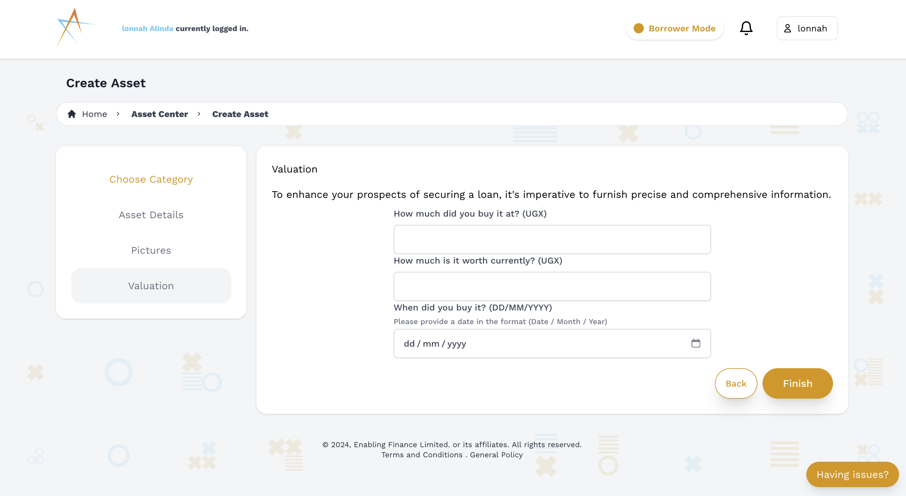

# Add Collateral Assets

## Introduction

Finablr enables users to register multiple collateral assets to their account listings. This documentation will guide you through the process of adding, managing, and understanding the importance of collateral assets within the Finablr ecosystem. Remember, registering collateral does not transfer ownership to Finablr; it simply helps in evaluating and securing your loan applications.

#### Before you proceed, take note of the following:
1. Take photos of your collateral asset.
2. Prepare valuation details, including the purchase price of the collateral.

## Steps to Add Collateral Assets

Here are the steps you need to follow to add a collateral asset:

1. **Go to [Add Collateral Asset](https://finablr.app/app/assets/create) and select a category.**  
   Begin by navigating to the asset creation page. Choose the appropriate category for your collateral to ensure it is properly classified.
   

2. **Provide detailed information about the asset.**  
   Fill in all the necessary details about your asset. This includes a description, specifications, and any other relevant information that will help in the **due diligence** process.
   

3. **Upload images of your collateral.**  
   A picture is worth a thousand words. Upload clear and high-quality images of your collateral to give a visual representation of its condition and value.
   

4. **Enter the valuation details.**  
   Provide the valuation details, including how much you purchased the collateral for and its current estimated value. Accurate valuation is crucial for fair loan assessments.
   

5. **Submit the collateral asset.**  
   Review all the information you’ve entered to ensure accuracy. Once everything looks good, submit your collateral asset to add it to your account listings.
